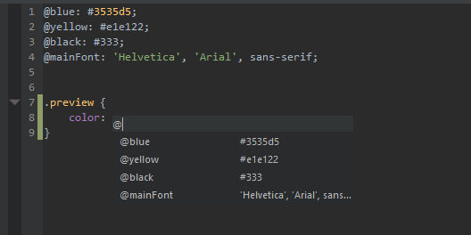
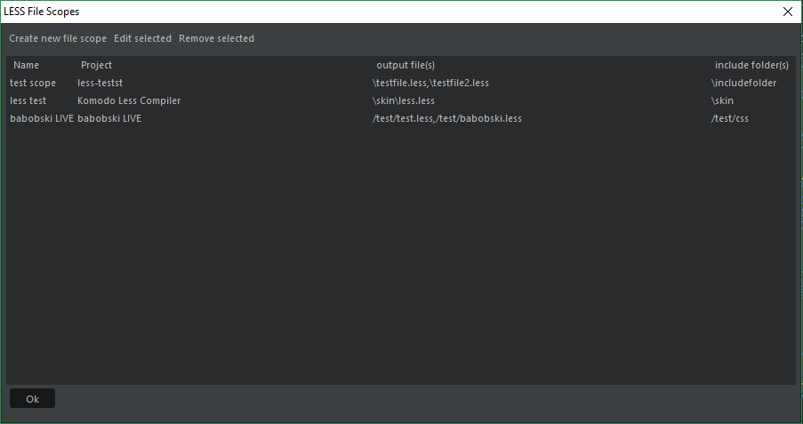
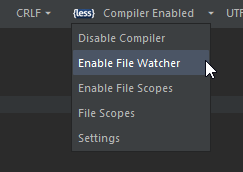

# Komodo Less Compiler
*LESS 2.7.1 compiler for Komodo Edit/Ide.*  
This addon gives you the ability to compile Less files and gives a improved auto-completion of Less variables (also includes imports).

## Usage
If you install this addon. default the compiler is enabled.  
When you edit a LESS file the file will be compiled to a CSS file.

If you have imports in you're Less-file or you want to run multiple output-files.  
You need to use a file scope this enables you to set up project based file scopes, that will trigger output-files based on output-files and include-folders.  
If you want to compile a file on the fly that has includes, you can also set up a single file watcher.  
This will trigger the selected output-file regardless of the Less-file you're working on.

Trough the Tools-menu and file context-menu are Less menu's added, that allows you to trigger file based commands and a few commands concerning file-watchers, file-scopes and auto-completion commands/settings.
Also is a status-bar added to the breadcrumb-bar that also has a context-menu that allows you to control various commands/settings.

## Less Status-bar
When editing Less files, a Less status bar will be shown.  
The status bar well tell you, if the compiler is enabled/disabled, if a file watcher or file scope is active and it will show errors if present.


Trough the status-bar you can easily configure the settings.

### Status-bar options
 * **Disable/Enable Compiler**  
 This will enable/disable the compiler.
 * **Disable/Enable File Watcher**  
 This will enable/disable a file watcher for the current file, when you edit less file's only the "Watched file" will be compiled.
 * **Disable/Enable File Scopes**  
 This will enable the "file scopes" mode, that will trigger file scopes based on projects.
 * **File Scopes**  
 This will open a window where you can set file scopes, so you can work with multiple output files in one project or work with multiple projects.
 * **Settings**  
 This will open the Less-settings window.

## Auto-completion
This addon will provide you with a LESS variables auto-completion.  
The vars will be search automatically( on file open and after you pressed @ on save ).

You can also trigger the search trough the menu.  
When you type @ a auto completion box will be shown.



## Menu Options
**Tools > LESS > ...**
 * **Compile Saved File into CSS**  
 Takes a .less file and creates a .css file with the same name in the same spot as the .less file.
 * **Compile Current Buffer (including imports)**  
 Takes the contents of the current buffer and turns it into CSS.
 * **Compile Selection into CSS (including imports)**  
 Takes the current selection and turns it into CSS
 * **Compile and Compress Saved File into CSS**  
 Takes a .less file and creates a .css file with the same name in the same spot as the .less file. The .less file will be compressed/minified.
 * **Compile and Compress Current Buffer (including imports)**  
 Takes the contents of the current buffer and turns it into compressed CSS.
 * **Compile and Compress Selection into CSS (including imports)**  
 Takes the current selection and turns it into compressed CSS.
 * **Collect @vars**  
 Collect all the LESS @vars for auto-completion.
 * **File Watcher**
  - **Enable File Watcher for current file**   
  Enables a file watcher for current LESS file
  - **disable File Watcher**  
  Disables the file watcher
 * **File Scopes**  
  - **Enable File Scopes**  
  Enables the "file-scopes" mode.
  - **Disable File Scopes**  
  Disables the "file-scopes" mode
 * **Less Settings**  
 This will open the settings window.
 
## File Scopes
File-scopes allow you to work with output-files and include-folders, these file scopes are set on a project level.  
When you edit a file in the include-folder(s) the selected output-files(s) are triggered.  
To create a new file-scope you will have to use the menu in the status-bar **status-bar > File Scopes**.
This will open the File scopes window, in this window you can edit, create or delete file scopes:
 

 
If you click the "Create new file scope" menu item, the following popup will shown:
 

 
In this window you can create you're project based file scopes, you can have multiple file scopes in one project.  
You can set up file scopes with the following structures:
 
```
 Include folder/
    ├─ Less file
    ├─ Less file
    ├─ Include folder/
    ├── Less file
    └── Less file   
─ Less output-file
 
```
 
 And:
 
```
 Include folder/
    ├─ Less file
    ├─ Less output-file
    ├─ Include folder/
    ├── Less file
    └── Less file
	
```
 
You can select multiple output-files, but is not recommended to use more that two output-files for performance reasons.
 
## File Watcher
If you want to edit a Less-file that has includes, on the fly.  
You can set up a File watcher, when you enable the file Watcher the current file will be added as output-file.  
When you now edit Less files only the output-file will be triggered.



